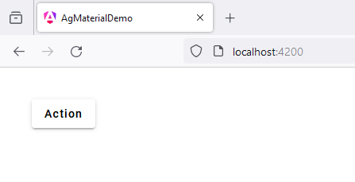
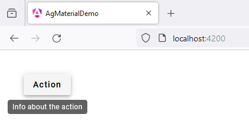

# 11 - MatTooltipModule
 
1. open `app.component.ts`

```
import { Component } from '@angular/core';
import { CommonModule } from '@angular/common';
import { RouterOutlet } from '@angular/router';

import {MatTooltipModule} from '@angular/material/tooltip';
import {MatButtonModule} from '@angular/material/button';

@Component({
  selector: 'app-root',
  standalone: true,
  imports: [
    CommonModule, 
    RouterOutlet,
    MatButtonModule,
    MatTooltipModule
  ],
  templateUrl: './app.component.html',
  styleUrl: './app.component.scss'
})
export class AppComponent {

  title = 'ag_material_demo';

}
```

2. open `app.component.html`

```
<button 
mat-raised-button
matTooltip="Info about the action"
aria-label="Button that displays a tooltip when focused or hovered over">

  Action

</button>
```

3. open `app.component.scss`

```
* {
  margin: 40px;
}
```



