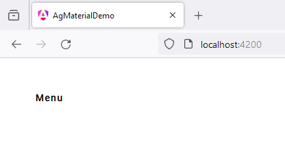
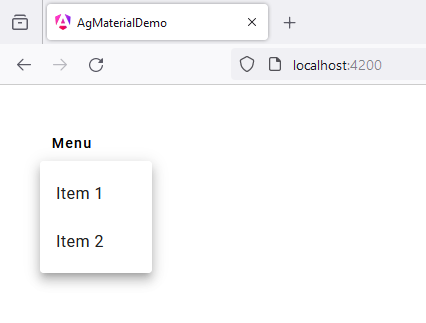

# 12 - MatMenuModule
 
1. open `app.component.ts`

```
import { Component } from '@angular/core';
import { CommonModule } from '@angular/common';
import { RouterOutlet } from '@angular/router';

import {MatMenuModule} from '@angular/material/menu';
import {MatButtonModule} from '@angular/material/button';

@Component({
  selector: 'app-root',
  standalone: true,
  imports: [
    CommonModule, 
    RouterOutlet,
    MatMenuModule,
    MatButtonModule
  ],
  templateUrl: './app.component.html',
  styleUrl: './app.component.scss'
})
export class AppComponent {

  title = 'ag_material_demo';

}
```

2. open `app.component.html`

```
<button mat-button [matMenuTriggerFor]="menu">Menu</button>

<mat-menu #menu="matMenu">

  <button mat-menu-item>Item 1</button>
  
  <button mat-menu-item>Item 2</button>
  
</mat-menu>
```

3. open `app.component.scss`

```
* {
  margin: 40px;
}
```



