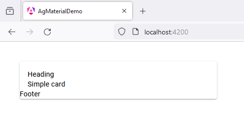

# 15 - MatCardModule - Footer
 
1. open `app.component.ts`

```
import { Component } from '@angular/core';
import { CommonModule } from '@angular/common';
import { RouterOutlet } from '@angular/router';

import {MatCardModule} from '@angular/material/card';

@Component({
  selector: 'app-root',
  standalone: true,
  imports: [
    CommonModule, 
    RouterOutlet,

    MatCardModule
  ],
  templateUrl: './app.component.html',
  styleUrl: './app.component.scss'
})
export class AppComponent {

  title = 'ag_material_demo';

}
```

2. open `app.component.html`

```
<mat-card>

  <mat-card-header>Heading</mat-card-header>

  <mat-card-content>Simple card</mat-card-content>

  <mat-card-footer>Footer</mat-card-footer>

</mat-card>
```

3. open `app.component.scss`

```
mat-card {
  margin: 40px;
  width: 400px;
}
```

