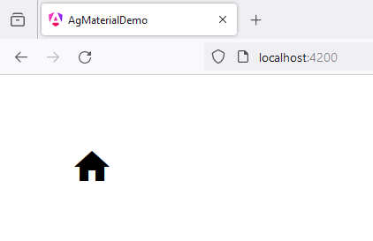

# 2 - MatIconModule
 
1. open `app.component.ts`

```
import { Component } from '@angular/core';
import { CommonModule } from '@angular/common';
import { RouterOutlet } from '@angular/router';

import {MatIconModule} from '@angular/material/icon';

@Component({
  selector: 'app-root',
  standalone: true,
  imports: [
    CommonModule, 
    RouterOutlet,
    MatIconModule
  ],
  templateUrl: './app.component.html',
  styleUrl: './app.component.scss'
})
export class AppComponent {

  title = 'ag_material_demo';

}
```

2. open `app.component.html`

```
<mat-icon aria-hidden="false" aria-label="Example home icon" fontIcon="home"></mat-icon>
```

3. open `app.component.scss`

```
* {
    margin: 40px;
}
```

