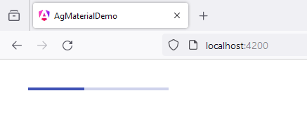

# 4 - MatProgressBarModule
 
1. open `app.component.ts`

```
import { Component } from '@angular/core';
import { CommonModule } from '@angular/common';
import { RouterOutlet } from '@angular/router';

import {MatProgressBarModule} from '@angular/material/progress-bar';

@Component({
  selector: 'app-root',
  standalone: true,
  imports: [
    CommonModule, 
    RouterOutlet,
    MatProgressBarModule,
  ],
  templateUrl: './app.component.html',
  styleUrl: './app.component.scss'
})
export class AppComponent {
  title = 'ag_material_demo';
}
```

2. open `app.component.html`

```
<mat-progress-bar mode="determinate" value="40"></mat-progress-bar>
```

3. open `app.component.scss`

```
* {
    margin: 40px;
}

mat-progress-bar {
    width: 200px;
}
```

