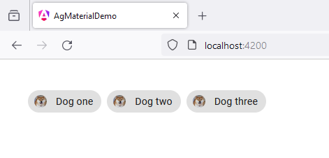

# 41 - MatChipsModule - Chips avatar
 
1. open `app.component.ts`

```
import { Component } from '@angular/core';
import { RouterOutlet } from '@angular/router';

import {MatChipsModule} from '@angular/material/chips';

@Component({
  selector: 'app-root',
  standalone: true,
  imports: [
    RouterOutlet,

    MatChipsModule
  ],
  templateUrl: './app.component.html',
  styleUrl: './app.component.scss'
})
export class AppComponent {

  title = 'ag_material_demo';

}
```

2. open `app.component.html`

```
<mat-chip-set aria-label="Dog selection">

  <mat-chip>
    
    Dog one
  </mat-chip>

  <mat-chip color="primary">
    
    Dog two
  </mat-chip>

  <mat-chip color="accent">
    
    Dog three
  </mat-chip>
  
</mat-chip-set>
```

3. open `app.component.scss`

```
mat-chip-set {
    margin: 40px;
}

.example-box.cdk-drag-animating {
    transition: transform 250ms cubic-bezier(0, 0, 0.2, 1);
}
  
.example-chip .cdk-drop-list-dragging {
    transition: transform 250ms cubic-bezier(0, 0, 0.2, 1);
}
```

