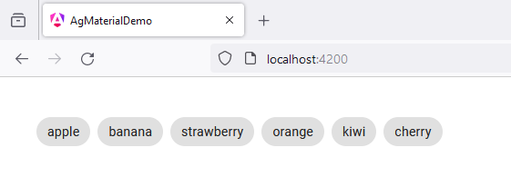
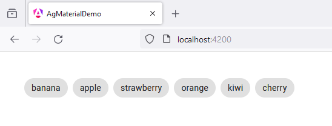

# 42 - MatChipsModule - Drag and Drop
 
1. open `app.component.ts`

```
import { Component } from '@angular/core';
import { RouterOutlet } from '@angular/router';

import {
  CdkDragDrop, 
  moveItemInArray, 
  CdkDrag, 
  CdkDropList
} from '@angular/cdk/drag-drop';

import {MatChipsModule} from '@angular/material/chips';

export interface Vegetable {
  name: string;
}


@Component({
  selector: 'app-root',
  standalone: true,
  imports: [
    RouterOutlet,

    MatChipsModule, 
    CdkDropList, 
    CdkDrag
  ],
  templateUrl: './app.component.html',
  styleUrl: './app.component.scss'
})
export class AppComponent {

  title = 'ag_material_demo';

  vegetables: Vegetable[] = [
    {name: 'apple'},
    {name: 'banana'},
    {name: 'strawberry'},
    {name: 'orange'},
    {name: 'kiwi'},
    {name: 'cherry'},
  ];

  drop(event: CdkDragDrop<Vegetable[]>) {
    moveItemInArray(this.vegetables, event.previousIndex, event.currentIndex);
  }

}
```

2. open `app.component.html`

```
<mat-chip-set
  class="example-chip"
  cdkDropList
  cdkDropListOrientation="horizontal"
  (cdkDropListDropped)="drop($event)">

  @for (vegetable of vegetables; track vegetable) {
    <mat-chip class="example-box" cdkDrag>{{vegetable.name}}</mat-chip>
  }
  
</mat-chip-set>
```

3. open `app.component.scss`

```
mat-chip-set {
    margin: 40px;
}

.example-box.cdk-drag-animating {
    transition: transform 250ms cubic-bezier(0, 0, 0.2, 1);
}
  
.example-chip .cdk-drop-list-dragging {
    transition: transform 250ms cubic-bezier(0, 0, 0.2, 1);
}
```



