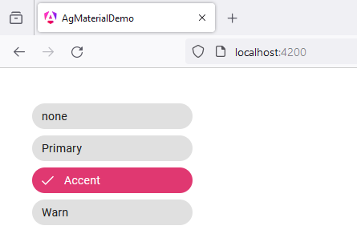

# 43 - MatChipsModule - Stacked chips
 
1. open `app.component.ts`

```
import { Component } from '@angular/core';
import { RouterOutlet } from '@angular/router';

import {ThemePalette} from '@angular/material/core';
import {MatChipsModule} from '@angular/material/chips';

export interface ChipColor {
  name: string;
  color: ThemePalette;
}

@Component({
  selector: 'app-root',
  standalone: true,
  imports: [
    RouterOutlet,

    MatChipsModule
  ],
  templateUrl: './app.component.html',
  styleUrl: './app.component.scss'
})
export class AppComponent {

  title = 'ag_material_demo';

  availableColors: ChipColor[] = [
    {name: 'none', color: undefined},
    {name: 'Primary', color: 'primary'},
    {name: 'Accent', color: 'accent'},
    {name: 'Warn', color: 'warn'},
  ];

}
```

2. open `app.component.html`

```
<mat-chip-listbox 
class="mat-mdc-chip-set-stacked" 
aria-label="Color selection">

  @for (chip of availableColors; track chip) {
    <mat-chip-option selected [color]="chip.color">{{chip.name}}</mat-chip-option>
  }
  
</mat-chip-listbox>
```

3. open `app.component.scss`

```
mat-chip-listbox {
    margin: 40px;
}

.mat-mdc-chip-set {
    max-width: 200px;
}
```


