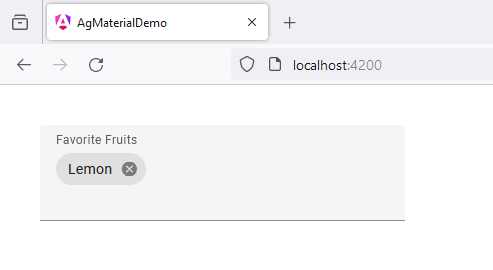
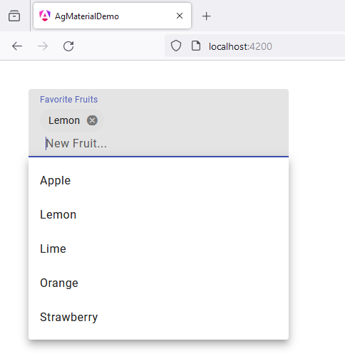
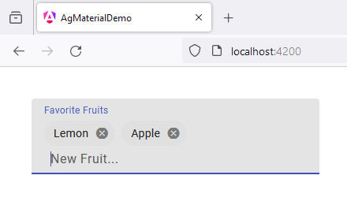

# 44 - MatChipsModule - Chips Autocomplete
 
1. open `app.component.ts`

```
// import { Component } from '@angular/core';
import { RouterOutlet } from '@angular/router';

import {COMMA, ENTER} from '@angular/cdk/keycodes';
import {Component, ElementRef, ViewChild, inject} from '@angular/core';
import {FormControl, FormsModule, ReactiveFormsModule} from '@angular/forms';
import {MatAutocompleteSelectedEvent, MatAutocompleteModule} from '@angular/material/autocomplete';
import {MatChipInputEvent, MatChipsModule} from '@angular/material/chips';
import {Observable} from 'rxjs';
import {map, startWith} from 'rxjs/operators';
import {MatIconModule} from '@angular/material/icon';
import {AsyncPipe} from '@angular/common';
import {MatFormFieldModule} from '@angular/material/form-field';
import {LiveAnnouncer} from '@angular/cdk/a11y';


@Component({
  selector: 'app-root',
  standalone: true,
  imports: [
    RouterOutlet,

    FormsModule,
    MatFormFieldModule,
    MatChipsModule,
    MatIconModule,
    MatAutocompleteModule,
    ReactiveFormsModule,
    AsyncPipe,
  ],
  templateUrl: './app.component.html',
  styleUrl: './app.component.scss'
})
export class AppComponent {

  title = 'ag_material_demo';

  separatorKeysCodes: number[] = [ENTER, COMMA];
  fruitCtrl = new FormControl('');
  filteredFruits: Observable<string[]>;
  fruits: string[] = ['Lemon'];
  allFruits: string[] = ['Apple', 'Lemon', 'Lime', 'Orange', 'Strawberry'];

  @ViewChild('fruitInput') fruitInput!: ElementRef<HTMLInputElement>;

  announcer = inject(LiveAnnouncer);

  constructor() {
    this.filteredFruits = this.fruitCtrl.valueChanges.pipe(
      startWith(null),
      map((fruit: string | null) => (fruit ? this._filter(fruit) : this.allFruits.slice())),
    );
  }

  add(event: MatChipInputEvent): void {
    const value = (event.value || '').trim();

    // Add our fruit
    if (value) {
      this.fruits.push(value);
    }

    // Clear the input value
    event.chipInput!.clear();

    this.fruitCtrl.setValue(null);
  }

  remove(fruit: string): void {
    const index = this.fruits.indexOf(fruit);

    if (index >= 0) {
      this.fruits.splice(index, 1);

      this.announcer.announce(`Removed ${fruit}`);
    }
  }

  selected(event: MatAutocompleteSelectedEvent): void {
    this.fruits.push(event.option.viewValue);
    this.fruitInput.nativeElement.value = '';
    this.fruitCtrl.setValue(null);
  }

  private _filter(value: string): string[] {
    const filterValue = value.toLowerCase();

    return this.allFruits.filter(fruit => fruit.toLowerCase().includes(filterValue));
  }

}
```

2. open `app.component.html`

```
<form>

  <mat-form-field class="example-chip-list">

    <mat-label>Favorite Fruits</mat-label>

    <mat-chip-grid #chipGrid aria-label="Fruit selection">
      @for (fruit of fruits; track fruit) {
        <mat-chip-row (removed)="remove(fruit)">
          {{fruit}}
          <button matChipRemove [attr.aria-label]="'remove ' + fruit">
            <mat-icon>cancel</mat-icon>
          </button>
        </mat-chip-row>
      }
    </mat-chip-grid>

    <input placeholder="New Fruit..." #fruitInput [formControl]="fruitCtrl"
      [matChipInputFor]="chipGrid" [matAutocomplete]="auto"
      [matChipInputSeparatorKeyCodes]="separatorKeysCodes"
      (matChipInputTokenEnd)="add($event)"/>

    <mat-autocomplete #auto="matAutocomplete" (optionSelected)="selected($event)">

      @for (fruit of filteredFruits | async; track fruit) {
        <mat-option [value]="fruit">{{fruit}}</mat-option>
      }

    </mat-autocomplete>

  </mat-form-field>
  
</form>
```

3. open `app.component.scss`

```
form {
    margin: 40px;
}

.example-chip-list {
    width: 20%;
}
```





