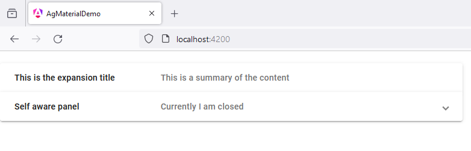

# 45 - MatExpansionModule - Basic
 
1. open `app.component.ts`

```
import { Component } from '@angular/core';
import { RouterOutlet } from '@angular/router';

import {MatExpansionModule} from '@angular/material/expansion';

@Component({
  selector: 'app-root',
  standalone: true,
  imports: [
    RouterOutlet,

    MatExpansionModule
  ],
  templateUrl: './app.component.html',
  styleUrl: './app.component.scss'
})
export class AppComponent {

  title = 'ag_material_demo';

  panelOpenState = false;
  
}
```

2. open `app.component.html`

```
<mat-accordion>

  <mat-expansion-panel hideToggle>

    <mat-expansion-panel-header>

      <mat-panel-title>
        This is the expansion title
      </mat-panel-title>

      <mat-panel-description>
        This is a summary of the content
      </mat-panel-description>

    </mat-expansion-panel-header>

    <p>This is the primary content of the panel.</p>

  </mat-expansion-panel>


  <mat-expansion-panel 
    (opened)="panelOpenState = true"
    (closed)="panelOpenState = false">

    <mat-expansion-panel-header>

      <mat-panel-title>
        Self aware panel
      </mat-panel-title>

      <mat-panel-description>
        Currently I am {{panelOpenState ? 'open' : 'closed'}}
      </mat-panel-description>

    </mat-expansion-panel-header>

    <p>I'm visible because I am open</p>

  </mat-expansion-panel>

</mat-accordion>
```

3. open `app.component.scss`

```
mat-accordion {
    margin: 40px;
}

mat-expansion-panel {
    width: 40%;
}
```

