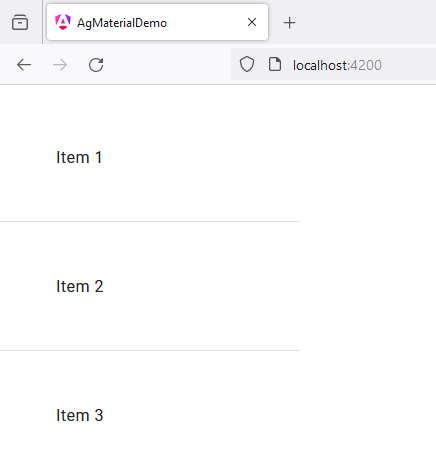

# 6 - MatDividerModule
 
1. open `app.component.ts`

```
import { Component } from '@angular/core';
import { CommonModule } from '@angular/common';
import { RouterOutlet } from '@angular/router';

import {MatDividerModule} from '@angular/material/divider';
import {MatListModule} from '@angular/material/list';

@Component({
  selector: 'app-root',
  standalone: true,
  imports: [
    CommonModule, 
    RouterOutlet,
    MatListModule,
    MatDividerModule
  ],
  templateUrl: './app.component.html',
  styleUrl: './app.component.scss'
})
export class AppComponent {

  title = 'ag_material_demo';

}
```

2. open `app.component.html`

```
<mat-list>

    <mat-list-item>Item 1</mat-list-item>
    
    <mat-divider></mat-divider>
    
    <mat-list-item>Item 2</mat-list-item>
    
    <mat-divider></mat-divider>
    
    <mat-list-item>Item 3</mat-list-item>
    
</mat-list>
```

3. open `app.component.scss`

```
* {
    margin: 40px;
}

mat-list {
    width: 300px;
}
```

