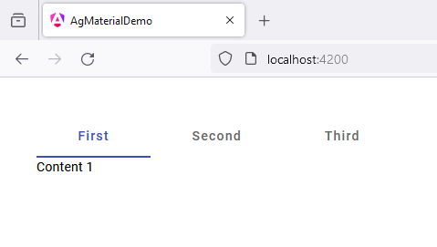

# 7 - MatTabsModule
 
1. open `app.component.ts`

```
import { Component } from '@angular/core';
import { CommonModule } from '@angular/common';
import { RouterOutlet } from '@angular/router';

import {MatTabsModule} from '@angular/material/tabs';

@Component({
  selector: 'app-root',
  standalone: true,
  imports: [
    CommonModule, 
    RouterOutlet,
    MatTabsModule
  ],
  templateUrl: './app.component.html',
  styleUrl: './app.component.scss'
})
export class AppComponent {

  title = 'ag_material_demo';

}
```

2. open `app.component.html`

```
<mat-tab-group>

  <mat-tab label="First"> Content 1 </mat-tab>

  <mat-tab label="Second"> Content 2 </mat-tab>

  <mat-tab label="Third"> Content 3 </mat-tab>

</mat-tab-group>
```

3. open `app.component.scss`

```
* {
    margin: 40px;
}

mat-tab-group {
    width: 600px;
}
```




